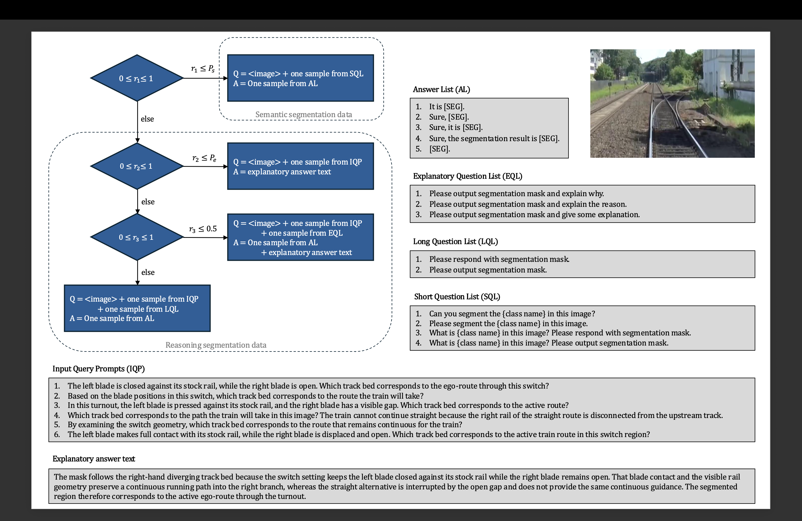
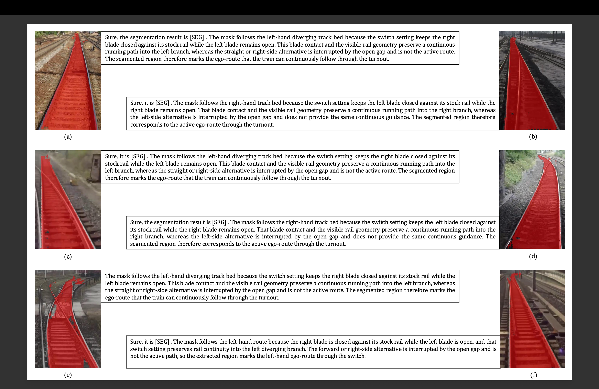

# Reasoning-guided Ego-path Segmentation for Autonomous Trains

[-blue)](https://github.com/JIA-Lab-research/LISA)

Official repository for the paper:
**Reasoning-guided Ego-path Segmentation for Autonomous Trains using Vision-language Models**.

This project is a railway-domain adaptation of LISA and is **forked from / built upon** the original LISA repository:
[https://github.com/JIA-Lab-research/LISA](https://github.com/JIA-Lab-research/LISA)

## Overview
Autonomous train perception in switch regions is not only a segmentation problem, but also a reasoning problem.
Given a forward-facing rail image and a language query, the model predicts:
1. The valid **ego-path mask**.
2. An optional **textual explanation** grounded in switch geometry (blade-stock contact, rail gap, path continuity).

## Highlights from the Attached Paper
- Railway switch understanding is formulated as **reasoning-guided ego-path segmentation**.
- LISA is adapted with rail-specific prompts, polygon masks, and explanation supervision.
- Initial evaluation uses RailSem19-based split (final 2,500 images for validation/testing protocol).
- Strong gains over base LISA checkpoint are reported under both reasoning and simple prompts.

### Reported Performance
Prompt A: `By examining rail continuity and switch geometry, segment the active ego-route.`

Prompt B: `Segment the track bed in this image.`

| Model | A CIoU (%) | A GIoU (%) | B CIoU (%) | B GIoU (%) |
|---|---:|---:|---:|---:|
| LISA (base) | 52.3 | 54.1 | 24.8 | 25.2 |
| Rail-finetuned LISA | **81.7** | **83.4** | **81.9** | **83.0** |

<br>

### Multimodal finetuning flowchart for a sample data
This flowchart summarizes the multimodal finetuning pipeline used in this project. Following the LISA design, the training stream mixes semantic rail supervision with rail reasoning segmentation supervision: semantic samples teach the model broad rail scene context, while reasoning samples teach it to choose the valid ego-route from switch geometry and language prompts. The random branching in the pipeline reflects how the model alternates between segmentation-only supervision and explanation-aware supervision during training.

<br>



<br>

### Qualitative results (success / inconsistency / failure cases)
This figure highlights both the strengths and current limitations of the rail-finetuned model. The input query here is: "By examining rail continuity and switch geometry, segment the active ego-route and explain why". Some examples show accurate ego-path masks with coherent explanations, while others reveal a gap between mask prediction and verbal reasoning: the mask may be correct but the explanation may contradict the visible switch geometry, and in harder scenes the explanation can be partially plausible even when the predicted mask fails. These cases are useful for understanding where stronger supervision and more faithful reasoning evaluation are still needed.

<br>



<br>

## What Changed vs Original LISA
- Added rail reasoning dataset branch: `reason_seg_rail` (`ReasonSegRail|train`).
- Added rail semantic segmentation support: `railsem` in `utils/sem_seg_dataset.py`.
- Added training flow for merged HF checkpoints via `--hf_merged_model`.
- Added HPC pipeline scripts:
  - `fine_tune_LISA.sbatch`
  - `fine_tune_LISA_nodes.sbatch`
  - `merge_LISA.sbatch`

## Dataset Layout
```text
├── dataset
│   ├── reason_seg
│   │   └── ReasonSegRail
│   │       ├── train
│   │       ├── val
│   │       └── explanatory
│   ├── RailSem19-SemSeg-LISA
│   │   ├── config_v2.0.json
│   │   ├── training
```
Please note that we are still actively improving this method and expect to introduce newer versions of both the model and the dataset. Because the dataset may be expanded, refined, or restructured as the project evolves, we have not released the full data here yet and it will remain unavailable until further notice.

## HPC Slurm Workflow
This repo includes cluster scripts for Apptainer-based training and merging.

### Pre-trained weights

#### LLaVA
To train LISA-7B or 13B, you need to follow the [instruction](https://github.com/haotian-liu/LLaVA/blob/main/docs/MODEL_ZOO.md) to merge the LLaVA delta weights. Typically, LISA authors use the final weights `LLaVA-Lightning-7B-v1-1` and `LLaVA-13B-v1-1` merged from `liuhaotian/LLaVA-Lightning-7B-delta-v1-1` and `liuhaotian/LLaVA-13b-delta-v1-1`, respectively. For Llama2, you can directly use the LLaVA full weights `liuhaotian/llava-llama-2-13b-chat-lightning-preview`.

#### SAM ViT-H weights
Download SAM ViT-H pre-trained weights from the [link](https://dl.fbaipublicfiles.com/segment_anything/sam_vit_h_4b8939.pth).

### Container Setup
The Slurm scripts expect an Apptainer/Singularity image file (`.sif`) referenced by the `IMG` variable inside the scripts. The container used for this project is available from DockerHub:
[https://hub.docker.com/repositories/mvakili96](https://hub.docker.com/repositories/mvakili96)

Pull or build the corresponding container image, convert it to a `.sif` if needed for your cluster, and update the `IMG` path in the Slurm scripts before launching jobs.


### Fine-tune
Edit container/dataset/checkpoint paths in `fine_tune_LISA.sbatch`, then run:
```bash
sbatch fine_tune_LISA.sbatch
```

If you prefer multi-node, you can run:
```bash
sbatch fine_tune_LISA_2nodes.sbatch
```

### Merge
After the fine-tuning is done, in order to get the full model weight, merge the LoRA weights of pytorch_model.bin, and save the resulting model into your desired path in the Hugging Face format, edit paths in `merge_LISA.sbatch`, then run:
```bash
sbatch merge_LISA.sbatch
```

### Finetune Script Contrast: `fine_tune_LISA.sbatch` vs `fine_tune_LISA_2nodes.sbatch`
| Item | `fine_tune_LISA.sbatch` | `fine_tune_LISA_2nodes.sbatch` |
|---|---|---|
| Purpose | Single-node fine-tuning | Multi-node distributed fine-tuning |
| SLURM scale | `--gres=gpu:1` | Typically `--nodes=2` with multiple GPUs per node |
| Launch style | `deepspeed --num_gpus=$NUM_GPUS ...` | Typically `deepspeed --num_nodes ... --num_gpus ...` (or equivalent multi-node launcher) |
| Networking | Localhost-style env (`MASTER_ADDR=127.0.0.1`) | Cross-node rendezvous (`MASTER_ADDR` as first node hostname/IP) |
| Recommended use | Fast debug / small experiments | Paper-scale training (e.g., 2-node, multi-GPU setup) |


## Citation
If this repository is useful for your work, please cite both this paper and LISA.

```bibtex
@inproceedings{ghorbanalivakili2026railreason,
  title={Reasoning-guided Ego-path Segmentation for Autonomous Trains using Vision-language Models},
  author={Ghorbanalivakili, Mohammadjavad and Varghese, Ashley and Sohn, Gunho},
  booktitle={Acccepted and to be Published on ISPRS Archives of Photogrammetry and Remote Sensing},
  year={2026},
  note={Update final volume/pages/DOI}
}

@inproceedings{lai2024lisa,
  title={LISA: Reasoning Segmentation via Large Language Model},
  author={Lai, Xin and Tian, Zhuotao and Chen, Yukang and Li, Yanwei and Yuan, Yuhui and Liu, Shu and Jia, Jiaya},
  booktitle={CVPR},
  year={2024}
}
```

## Acknowledgement
This work is built upon:
- [LISA](https://github.com/JIA-Lab-research/LISA)
- [LLaVA](https://github.com/haotian-liu/LLaVA)
- [Segment Anything (SAM)](https://github.com/facebookresearch/segment-anything)

