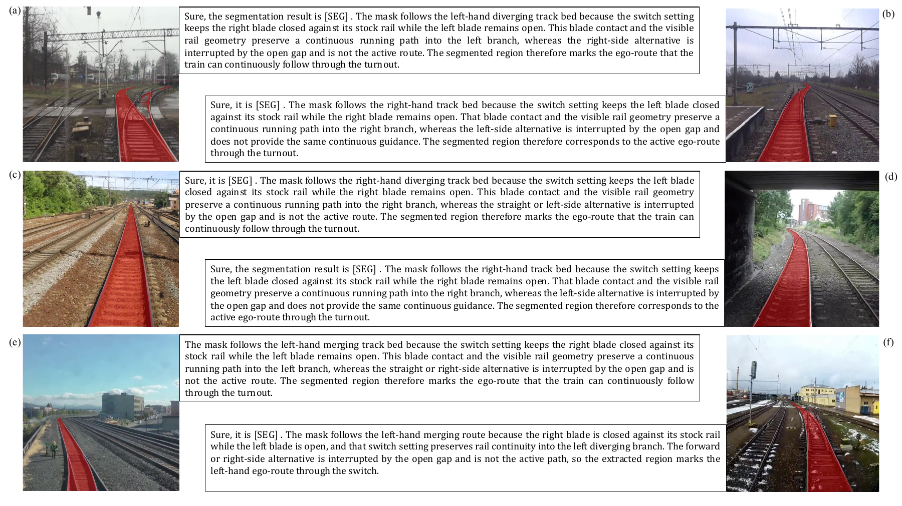
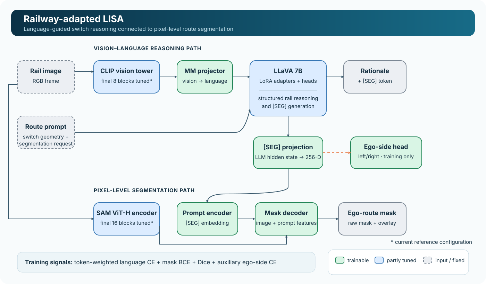

# Railway Perception Foundation Model

### Reasoning-guided ego-path segmentation for railway switches

[](LICENSE)


[](https://github.com/JIA-Lab-research/LISA)


This is the official implementation of [Reasoning-guided Ego-path Segmentation for Autonomous Trains using Vision-language Models](https://doi.org/10.5194/isprs-archives-XLIX-B3-2026-89-2026), extended with selective CLIP/SAM tuning, weighted rail-reasoning tokens, counterfactual flipping, and an auxiliary ego-side loss. It predicts a binary ego-route mask and optional rationale from a rail image and text prompt.

> [!CAUTION]
> Research prototype only. Masks and rationales can be wrong or inconsistent and must not be used for safety-critical decisions.

## Results

The validation-selected joint semantic-and-reasoning checkpoint was evaluated on 2,000 held-out images: 1,822 switch-independent images and 178 switch-dependent images where route selection requires interpreting a visible downstream switch. Scores are percentages against the ground-truth ego-route.

Prompts used:

- **Reasoning-oriented:** `By examining rail continuity and switch geometry, segment the active ego-route the train is following in this image.`
- **Generic:** `Segment the track bed in this image.`

| Model | Reasoning: switch-independent CIoU | Reasoning: switch-independent GIoU | Reasoning: switch-dependent CIoU | Reasoning: switch-dependent GIoU | Generic: switch-independent CIoU | Generic: switch-independent GIoU | Generic: switch-dependent CIoU | Generic: switch-dependent GIoU |
|---|---|---|---|---|---|---|---|---|
| Original LISA | 30.07 | 32.39 | 36.59 | 39.73 | 8.25 | 7.70 | 4.87 | 4.57 |
| Rail-finetuned LISA — semantic only | 66.23 | 66.15 | 56.95 | 57.97 | 65.92 | 66.03 | 57.21 | 58.18 |
| **Rail-finetuned LISA — semantic + reasoning** | **89.00** | **88.34** | **90.49** | **90.33** | 65.58 | 65.94 | 57.87 | 58.89 |

CIoU is the sum of intersections divided by the sum of unions across a subset; GIoU is the mean of image-level IoU. Compared with semantic-only training, joint training gains 22.77/22.19 CIoU/GIoU points on switch-independent scenes and 33.53/32.35 on switch-dependent scenes; all paired-bootstrap 95% confidence intervals are above zero.

### Paired-bootstrap comparison

Improvements over semantic-only finetuning from 10,000 paired image-level percentile-bootstrap resamples (95% confidence level, seed 2026):

| Scene type | Metric | Difference (percentage points) | Paired-bootstrap 95% confidence interval |
|---|---|---|---|
| Switch-independent | CIoU | +22.77 | [22.00, 23.53] |
| Switch-independent | GIoU | +22.19 | [21.50, 22.89] |
| Switch-dependent | CIoU | +33.53 | [31.10, 36.07] |
| Switch-dependent | GIoU | +32.35 | [30.10, 34.68] |

### Route-logic audit

Results on 30 switch-dependent images: 15 turnout/15 merge and 15 left-active/15 right-active, without requiring equal counts for every type–direction combination.

A strict mask is correct only when the intended route has the highest IoU, intended-route IoU is above 0.90, the prediction reaches a route-exclusive region, and competing-route coverage in route-exclusive pixels is below 0.10.

**(a) Output-level correctness**

| Assessment | Correct | Incorrect |
|---|---|---|
| Strict mask criterion | 24 (80.0%) | 6 (20.0%) |
| Switch type in rationale | 26 (86.7%) | 4 (13.3%) |
| Active-route direction in rationale | 21 (70.0%) | 9 (30.0%) |
| Switch type and direction jointly | 18 (60.0%) | 12 (40.0%) |

**(b) Paired mask–rationale outcomes**

| Mask assessment | Type and direction correct | At least one incorrect | Total |
|---|---|---|---|
| Correct | 13 | 11 | 24 |
| Incorrect | 5 | 1 | 6 |
| **Total** | **18** | **12** | **30** |

Evaluation notes:

- Generic-prompt results are measured against the ego-route mask, not an all-track-bed ground truth; they are not all-track-bed segmentation accuracy.
- Shared track regions can hide wrong-branch predictions in aggregate IoU; rationales are auxiliary outputs, not verified explanations.

### Qualitative examples



Red overlays are predicted masks; adjacent text is model-generated.

## Model and Training



CLIP encodes the image for LLaVA, which combines it with the route prompt and generates a rationale containing `[SEG]`. The `[SEG]` hidden state is projected to 256 dimensions and passed to SAM's prompt encoder; SAM's image encoder and mask decoder then produce the ego-route mask.

The included two-node job is the current reference configuration:

- **Trainable components:** LLM LoRA `q_proj`/`v_proj` adapters, token embeddings and language head, the `[SEG]` projection, multimodal projector, SAM prompt and mask decoders, the final 16 SAM blocks, the final 8 CLIP blocks used by LLaVA, and the ego-side head. Other CLIP/SAM blocks remain frozen.
- **Supervision and loss:** semantic masks teach rail appearance; reasoning samples use fixed fields for switch type, both blade states, connected/disconnected paths, and the final left/right ego-path. Exact token alignment gives switch-type and right-blade-state targets 60× language-CE weight. The reference loss is `weighted CE + 2× mask BCE + Dice + 3× ego-side CE`; optional boundary and pixel-map BCE weights are supported but disabled in the reference job.
- **Counterfactual augmentation:** with probability 0.5, a reasoning sample is flipped horizontally together with its mask, optional weight map, every left/right term in its rationale, and its ego-side label.
- **Monitoring:** TensorBoard and optional W&B record loss components, switch/right-blade token CE and accuracy, learning rates, and validation CIoU/GIoU. End-of-epoch probes generate rationales from a fixed image set using the live distributed model.

### What changed from original LISA

- Railway semantic and structured reasoning datasets ([`utils/sem_seg_dataset.py`](utils/sem_seg_dataset.py), [`utils/reason_seg_dataset.py`](utils/reason_seg_dataset.py)).
- Token-aligned reasoning targets and left/right-consistent augmentation ([`utils/rail_reasoning.py`](utils/rail_reasoning.py), [`utils/rail_augmentation.py`](utils/rail_augmentation.py)).
- Selective CLIP/SAM tuning, weighted losses, and auxiliary ego-side prediction ([`train_ds.py`](train_ds.py), [`model/LISA.py`](model/LISA.py)).
- Merged Hugging Face checkpoint support and folder-based inference ([`merge_lora_weights_and_save_hf_model.py`](merge_lora_weights_and_save_hf_model.py), [`chat_batch.py`](chat_batch.py)).

## Dataset Layout

### Data composition and preprocessing

| Data type (n) | RailSem19 source and selection | Input dimensions | Encoder-specific preprocessing |
|---|---|---|---|
| **Semantic training (6,000)** | First 6,000 images; all included. | Unscaled 1024×1024 crops; horizontally centered, bottom-aligned | **CLIP:** shortest side to 224; 224×224 center crop; normalize.<br>**SAM:** normalize; no resizing or padding. |
| **Reasoning: close-up (126)** | Qualifying switch scenes from images 1–4,000; annotated ego-path traverses a switch region whose configuration is visually discernible; per-image ROI retains the switch mechanism and relevant route geometry. | Width: 170–1266; height: 102–659 pixels | **CLIP:** shortest side to 224; 224×224 center crop; normalize.<br>**SAM:** if needed, resize the longest side down to 1024 while preserving aspect ratio; normalize; zero-pad to 1024×1024. Images are never upscaled. |
| **Reasoning: wider context (116)** | Qualifying switch scenes from images 1–4,000 under the same visible-switch criterion; surrounding context retained. | 1024×1024 | **CLIP:** shortest side to 224; 224×224 center crop; normalize.<br>**SAM:** normalize; no resizing or padding. |
| **Validation (500)** | RailSem19 images 8,001–8,500; held out from training. | Unscaled 1024×1024 crops; horizontally centered, bottom-aligned | **CLIP:** shortest side to 224; 224×224 center crop; normalize.<br>**SAM:** normalize; no resizing or padding. |
| **Test (2,000)** | RailSem19 images 6,001–8,000; held out from training and validation. | Unscaled 1024×1024 crops; horizontally centered, bottom-aligned | **CLIP:** shortest side to 224; 224×224 center crop; normalize.<br>**SAM:** normalize; no resizing or padding. |

### Reasoning-training distribution

Counts are before stochastic counterfactual flipping.

| Switch topology | Active ego-route | Close-up | Wider context | Total |
|---|---|---|---|---|
| **Turnout** | Right | 42 | 33 | 75 |
| **Turnout** | Left | 33 | 37 | 70 |
| **Merge** | Right | 28 | 25 | 53 |
| **Merge** | Left | 23 | 21 | 44 |
| **Total** |  | **126** | **116** | **242** |

### Expected directory structure

```text
├── dataset
│   ├── reason_seg
│   │   └── ReasonSegRail
│   │       ├── train
│   │       ├── val
│   │       └── explanatory
│   ├── RailSem19-SemSeg-LISA
│   │   ├── config_v2.0.json
│   │   ├── training
```
Please note that we are still actively improving this method and expect to introduce newer versions of both the model and the dataset. Because the dataset may be expanded, refined, or restructured as the project evolves, we have not released the full data here yet and it will remain unavailable until further notice.

## HPC Slurm Workflow
This repo includes cluster scripts for Apptainer-based training and merging.

### Pre-trained weights

#### LLaVA
To train LISA-7B or 13B, you need to follow the [instruction](https://github.com/haotian-liu/LLaVA/blob/main/docs/MODEL_ZOO.md) to merge the LLaVA delta weights. Typically, LISA authors use the final weights `LLaVA-Lightning-7B-v1-1` and `LLaVA-13B-v1-1` merged from `liuhaotian/LLaVA-Lightning-7B-delta-v1-1` and `liuhaotian/LLaVA-13b-delta-v1-1`, respectively. For Llama2, you can directly use the LLaVA full weights `liuhaotian/llava-llama-2-13b-chat-lightning-preview`.

#### SAM ViT-H weights
Download SAM ViT-H pre-trained weights from the [link](https://dl.fbaipublicfiles.com/segment_anything/sam_vit_h_4b8939.pth).

### Container Setup
The Slurm scripts expect an Apptainer/Singularity image file (`.sif`) referenced by the `IMG` variable inside the scripts. The container used for this project is available from DockerHub:
[https://hub.docker.com/repositories/mvakili96](https://hub.docker.com/repositories/mvakili96)

Pull or build the corresponding container image, convert it to a `.sif` if needed for your cluster, and update the `IMG` path in the Slurm scripts before launching jobs.


### Fine-tune
Edit container/dataset/checkpoint paths in `fine_tune_LISA.sbatch`, then run:
```bash
sbatch fine_tune_LISA.sbatch
```

If you prefer multi-node, you can run:
```bash
sbatch fine_tune_LISA_2nodes.sbatch
```

### Merge
After the fine-tuning is done, in order to get the full model weight, merge the LoRA weights of pytorch_model.bin, and save the resulting model into your desired path in the Hugging Face format, edit paths in `merge_LISA.sbatch`, then run:
```bash
sbatch merge_LISA.sbatch
```

### Finetune Script Contrast: `fine_tune_LISA.sbatch` vs `fine_tune_LISA_2nodes.sbatch`
| Item | `fine_tune_LISA.sbatch` | `fine_tune_LISA_2nodes.sbatch` |
|---|---|---|
| Purpose | Single-node fine-tuning | Multi-node distributed fine-tuning |
| SLURM scale | `--gres=gpu:1` | Typically `--nodes=2` with multiple GPUs per node |
| Launch style | `deepspeed --num_gpus=$NUM_GPUS ...` | Typically `deepspeed --num_nodes ... --num_gpus ...` (or equivalent multi-node launcher) |
| Networking | Localhost-style env (`MASTER_ADDR=127.0.0.1`) | Cross-node rendezvous (`MASTER_ADDR` as first node hostname/IP) |
| Recommended use | Fast debug / small experiments | Paper-scale training (e.g., 2-node, multi-GPU setup) |


## Citation
If this repository is useful for your work, please cite both this paper and LISA.

```bibtex
@inproceedings{ghorbanalivakili2026railreason,
  title={Reasoning-guided Ego-path Segmentation for Autonomous Trains using Vision-language Models},
  author={Ghorbanalivakili, Mohammadjavad and Varghese, Ashley and Sohn, Gunho},
  booktitle={Acccepted and to be Published on ISPRS Archives of Photogrammetry and Remote Sensing},
  year={2026},
  note={Update final volume/pages/DOI}
}

@inproceedings{lai2024lisa,
  title={LISA: Reasoning Segmentation via Large Language Model},
  author={Lai, Xin and Tian, Zhuotao and Chen, Yukang and Li, Yanwei and Yuan, Yuhui and Liu, Shu and Jia, Jiaya},
  booktitle={CVPR},
  year={2024}
}
```

## Acknowledgement
This work is built upon:
- [LISA](https://github.com/JIA-Lab-research/LISA)
- [LLaVA](https://github.com/haotian-liu/LLaVA)
- [Segment Anything (SAM)](https://github.com/facebookresearch/segment-anything)
